# Declaration

These are my Solidity learning notes. The content is referenced from the following communities. I am very grateful to these communities for providing such comprehensive learning materials.

[RemoteCodeCamp](https://solidity-rcc.vercel.app/docs/solidity-basic/intro)

[Solidity Docs](https://docs.soliditylang.org/en/v0.8.26/)    [Hardhat docs](https://hardhat.org/docs)    [ethers api docs](https://docs.ethers.org/v6/api/)    [Ethererum Docs](https://ethereum.org/zh/developers/docs/)

# Getting Start

## Install development environment
### Install Hardhat
[Hardhat Reference](https://hardhat.org/hardhat-runner/docs/getting-started#installation)

Run the below command in your shell

```she
yarn add --dev hardhat
```

```shell
(base) ➜  chain yarn add --dev hardhat
yarn add v1.22.17
info No lockfile found.
[1/4] 🔍  Resolving packages...
warning hardhat > glob@7.2.0: Glob versions prior to v9 are no longer supported
warning hardhat > mocha > glob@8.1.0: Glob versions prior to v9 are no longer supported
warning hardhat > glob > inflight@1.0.6: This module is not supported, and leaks memory. Do not use it. Check out lru-cache if you want a good and tested way to coalesce async requests by a key value, which is much more comprehensive and powerful.
warning hardhat > mocha > glob > inflight@1.0.6: This module is not supported, and leaks memory. Do not use it. Check out lru-cache if you want a good and tested way to coalesce async requests by a key value, which is much more comprehensive and powerful.
[2/4] 🚚  Fetching packages...
[3/4] 🔗  Linking dependencies...
[4/4] 🔨  Building fresh packages...
success Saved lockfile.
warning Your current version of Yarn is out of date. The latest version is "1.22.22", while you're on "1.22.17".
info To upgrade, run the following command:
$ curl --compressed -o- -L https://yarnpkg.com/install.sh | bash
success Saved 180 new dependencies.
info Direct dependencies
└─ hardhat@2.22.7
info All dependencies
├─ @ethersproject/abi@5.7.0
├─ @ethersproject/abstract-provider@5.7.0
├─ @ethersproject/abstract-signer@5.7.0
├─ @ethersproject/hash@5.7.0
├─ @ethersproject/networks@5.7.1
├─ @ethersproject/signing-key@5.7.0
├─ @ethersproject/transactions@5.7.0
├─ @ethersproject/web@5.7.1
├─ @fastify/busboy@2.1.1
├─ @metamask/eth-sig-util@4.0.1
├─ @noble/secp256k1@1.7.1
├─ @nomicfoundation/edr-darwin-arm64@0.5.0
├─ @nomicfoundation/edr-darwin-x64@0.5.0
├─ @nomicfoundation/edr-linux-arm64-gnu@0.5.0
├─ @nomicfoundation/edr-linux-arm64-musl@0.5.0
├─ @nomicfoundation/edr-linux-x64-gnu@0.5.0
├─ @nomicfoundation/edr-linux-x64-musl@0.5.0
├─ @nomicfoundation/edr-win32-x64-msvc@0.5.0
├─ @nomicfoundation/edr@0.5.0
├─ @nomicfoundation/ethereumjs-tx@5.0.4
├─ @nomicfoundation/solidity-analyzer-darwin-arm64@0.1.2
├─ @nomicfoundation/solidity-analyzer-darwin-x64@0.1.2
├─ @nomicfoundation/solidity-analyzer-linux-arm64-gnu@0.1.2
├─ @nomicfoundation/solidity-analyzer-linux-arm64-musl@0.1.2
├─ @nomicfoundation/solidity-analyzer-linux-x64-gnu@0.1.2
├─ @nomicfoundation/solidity-analyzer-linux-x64-musl@0.1.2
├─ @nomicfoundation/solidity-analyzer-win32-x64-msvc@0.1.2
├─ @nomicfoundation/solidity-analyzer@0.1.2
├─ @scure/bip32@1.1.5
├─ @scure/bip39@1.1.1
├─ @sentry/core@5.30.0
├─ @sentry/node@5.30.0
├─ @sentry/tracing@5.30.0
├─ @types/bn.js@5.1.5
├─ @types/lru-cache@5.1.1
├─ @types/pbkdf2@3.1.2
├─ @types/secp256k1@4.0.6
├─ adm-zip@0.4.16
├─ agent-base@6.0.2
├─ ansi-align@3.0.1
├─ ansi-colors@4.1.3
├─ ansi-escapes@4.3.2
├─ ansi-regex@5.0.1
├─ ansi-styles@4.3.0
├─ anymatch@3.1.3
├─ argparse@2.0.1
├─ base-x@3.0.10
├─ binary-extensions@2.3.0
├─ blakejs@1.2.1
├─ boxen@5.1.2
├─ brace-expansion@2.0.1
├─ braces@3.0.3
├─ browser-stdout@1.3.1
├─ browserify-aes@1.2.0
├─ bs58@4.0.1
├─ bs58check@2.1.2
├─ buffer-from@1.1.2
├─ buffer-xor@1.0.3
├─ bytes@3.1.2
├─ camelcase@6.3.0
├─ chokidar@3.6.0
├─ ci-info@2.0.0
├─ cipher-base@1.0.4
├─ clean-stack@2.2.0
├─ cli-boxes@2.2.1
├─ cliui@7.0.4
├─ color-convert@2.0.1
├─ color-name@1.1.4
├─ command-exists@1.2.9
├─ commander@8.3.0
├─ concat-map@0.0.1
├─ cookie@0.4.2
├─ create-hmac@1.1.7
├─ decamelize@4.0.0
├─ depd@2.0.0
├─ diff@5.2.0
├─ elliptic@6.5.6
├─ emoji-regex@8.0.0
├─ enquirer@2.4.1
├─ env-paths@2.2.1
├─ escalade@3.1.2
├─ escape-string-regexp@1.0.5
├─ ethereum-cryptography@0.1.3
├─ ethereumjs-util@6.2.1
├─ ethjs-util@0.1.6
├─ evp_bytestokey@1.0.3
├─ fill-range@7.1.1
├─ find-up@2.1.0
├─ flat@5.0.2
├─ follow-redirects@1.15.6
├─ fp-ts@1.19.3
├─ fs-extra@7.0.1
├─ fsevents@2.3.3
├─ get-caller-file@2.0.5
├─ glob-parent@5.1.2
├─ glob@7.2.0
├─ graceful-fs@4.2.11
├─ hardhat@2.22.7
├─ he@1.2.0
├─ http-errors@2.0.0
├─ https-proxy-agent@5.0.1
├─ iconv-lite@0.4.24
├─ immutable@4.3.7
├─ indent-string@4.0.0
├─ io-ts@1.10.4
├─ is-binary-path@2.1.0
├─ is-extglob@2.1.1
├─ is-fullwidth-code-point@3.0.0
├─ is-glob@4.0.3
├─ is-number@7.0.0
├─ is-plain-obj@2.1.0
├─ is-unicode-supported@0.1.0
├─ js-yaml@4.1.0
├─ jsonfile@4.0.0
├─ keccak@3.0.4
├─ locate-path@2.0.0
├─ lodash@4.17.21
├─ log-symbols@4.1.0
├─ lru_map@0.3.3
├─ memorystream@0.3.1
├─ minimatch@5.1.6
├─ mnemonist@0.38.5
├─ mocha@10.7.0
├─ ms@2.1.2
├─ normalize-path@3.0.0
├─ obliterator@2.0.4
├─ os-tmpdir@1.0.2
├─ p-limit@1.3.0
├─ p-locate@2.0.0
├─ p-map@4.0.0
├─ p-try@1.0.0
├─ path-exists@3.0.0
├─ path-is-absolute@1.0.1
├─ path-parse@1.0.7
├─ pbkdf2@3.1.2
├─ picomatch@2.3.1
├─ raw-body@2.5.2
├─ readdirp@3.6.0
├─ require-directory@2.1.1
├─ resolve@1.17.0
├─ ripemd160@2.0.2
├─ rlp@2.2.7
├─ safe-buffer@5.2.1
├─ safer-buffer@2.1.2
├─ scrypt-js@3.0.1
├─ secp256k1@4.0.3
├─ semver@6.3.1
├─ serialize-javascript@6.0.2
├─ setimmediate@1.0.5
├─ setprototypeof@1.2.0
├─ solc@0.8.26
├─ source-map-support@0.5.21
├─ source-map@0.6.1
├─ stacktrace-parser@0.1.10
├─ statuses@2.0.1
├─ string_decoder@1.3.0
├─ strip-hex-prefix@1.0.0
├─ strip-json-comments@3.1.1
├─ supports-color@7.2.0
├─ tmp@0.0.33
├─ to-regex-range@5.0.1
├─ toidentifier@1.0.1
├─ tsort@0.0.1
├─ tweetnacl-util@0.15.1
├─ tweetnacl@1.0.3
├─ type-fest@0.20.2
├─ undici-types@6.13.0
├─ undici@5.28.4
├─ universalify@0.1.2
├─ unpipe@1.0.0
├─ util-deprecate@1.0.2
├─ uuid@8.3.2
├─ widest-line@3.1.0
├─ workerpool@6.5.1
├─ ws@7.5.10
├─ y18n@5.0.8
├─ yargs-parser@20.2.9
├─ yargs-unparser@2.0.0
├─ yargs@16.2.0
└─ yocto-queue@0.1.0
✨  Done in 44.24s.
```

### Run Hardhat

```shell
npx hardhat
```

```shel
(base) ➜  chain npx hardhat
Hardhat version 2.22.7

Usage: hardhat [GLOBAL OPTIONS] [SCOPE] <TASK> [TASK OPTIONS]

GLOBAL OPTIONS:

  --config              A Hardhat config file. 
  --emoji               Use emoji in messages. 
  --flamegraph          Generate a flamegraph of your Hardhat tasks 
  --help                Shows this message, or a task's help if its name is provided 
  --max-memory          The maximum amount of memory that Hardhat can use. 
  --network             The network to connect to. 
  --show-stack-traces   Show stack traces (always enabled on CI servers). 
  --tsconfig            A TypeScript config file. 
  --typecheck           Enable TypeScript type-checking of your scripts/tests 
  --verbose             Enables Hardhat verbose logging 
  --version             Shows hardhat's version. 


AVAILABLE TASKS:

  check                 Check whatever you need
  clean                 Clears the cache and deletes all artifacts
  compile               Compiles the entire project, building all artifacts
  console               Opens a hardhat console
  coverage              Generates a code coverage report for tests
  flatten               Flattens and prints contracts and their dependencies. If no file is passed, all the contracts in the project will be flattened.
  gas-reporter:merge 
  help                  Prints this message
  node                  Starts a JSON-RPC server on top of Hardhat Network
  run                   Runs a user-defined script after compiling the project
  test                  Runs mocha tests
  typechain             Generate Typechain typings for compiled contracts
  verify                Verifies a contract on Etherscan or Sourcify


AVAILABLE TASK SCOPES:

  ignition              Deploy your smart contracts using Hardhat Ignition
  vars                  Manage your configuration variables

To get help for a specific task run: npx hardhat help [SCOPE] <TASK>
```

### Initialize a project

```shell
npx hardhat init
```

```shell
(base) ➜  chain npx hardhat init
888    888                      888 888               888
888    888                      888 888               888
888    888                      888 888               888
8888888888  8888b.  888d888 .d88888 88888b.   8888b.  888888
888    888     "88b 888P"  d88" 888 888 "88b     "88b 888
888    888 .d888888 888    888  888 888  888 .d888888 888
888    888 888  888 888    Y88b 888 888  888 888  888 Y88b.
888    888 "Y888888 888     "Y88888 888  888 "Y888888  "Y888

👷 Welcome to Hardhat v2.22.7 👷‍

✔ What do you want to do? · Create a TypeScript project
✔ Hardhat project root: · /projectpath
✔ Do you want to add a .gitignore? (Y/n) · y
✔ Help us improve Hardhat with anonymous crash reports & basic usage data? (Y/n) · y
✔ Do you want to install this sample project's dependencies with yarn (@nomicfoundation/hardhat-network-helpers @nomicfoundation/hardhat-verify chai hardhat-gas-reporter solidity-coverage @nomicfoundation/hardhat-ignition @types/chai @types/mocha @types/node ts-node typescript @nomicfoundation/hardhat-toolbox @nomicfoundation/hardhat-chai-matchers @nomicfoundation/hardhat-ethers ethers @typechain/hardhat typechain @typechain/ethers-v6 @nomicfoundation/hardhat-ignition-ethers)? (Y/n) · y


yarn add --dev "@nomicfoundation/hardhat-network-helpers@^1.0.0" "@nomicfoundation/hardhat-verify@^2.0.0" "chai@^4.2.0" "hardhat-gas-reporter@^1.0.8" "solidity-coverage@^0.8.0" "@nomicfoundation/hardhat-ignition@^0.15.0" "@types/chai@^4.2.0" "@types/mocha@>=9.1.0" "@types/node@>=18.0.0" "ts-node@>=8.0.0" "typescript@>=4.5.0" "@nomicfoundation/hardhat-toolbox@^5.0.0" "@nomicfoundation/hardhat-chai-matchers@^2.0.0" "@nomicfoundation/hardhat-ethers@^3.0.0" "ethers@^6.4.0" "@typechain/hardhat@^9.0.0" "typechain@^8.3.0" "@typechain/ethers-v6@^0.5.0" "@nomicfoundation/hardhat-ignition-ethers@^0.15.0"
yarn add v1.22.17
warning package.json: No license field
warning No license field
[1/4] 🔍  Resolving packages...
warning solidity-coverage > globby > glob@7.2.3: Glob versions prior to v9 are no longer supported
warning solidity-coverage > shelljs > glob@7.2.3: Glob versions prior to v9 are no longer supported
warning solidity-coverage > sc-istanbul > glob@5.0.15: Glob versions prior to v9 are no longer supported
warning typechain > glob@7.1.7: Glob versions prior to v9 are no longer supported
[2/4] 🚚  Fetching packages...
[3/4] 🔗  Linking dependencies...
warning " > @nomicfoundation/hardhat-ignition-ethers@0.15.5" has unmet peer dependency "@nomicfoundation/ignition-core@^0.15.5".
[4/4] 🔨  Building fresh packages...
success Saved lockfile.
warning No license field
success Saved 204 new dependencies.
info Direct dependencies
├─ @nomicfoundation/hardhat-chai-matchers@2.0.7
├─ @nomicfoundation/hardhat-ethers@3.0.6
├─ @nomicfoundation/hardhat-ignition-ethers@0.15.5
├─ @nomicfoundation/hardhat-ignition@0.15.5
├─ @nomicfoundation/hardhat-network-helpers@1.0.11
├─ @nomicfoundation/hardhat-toolbox@5.0.0
├─ @nomicfoundation/hardhat-verify@2.0.9
├─ @typechain/ethers-v6@0.5.1
├─ @typechain/hardhat@9.1.0
├─ @types/chai@4.3.17
├─ @types/mocha@10.0.7
├─ chai@4.5.0
├─ ethers@6.13.2
├─ hardhat-gas-reporter@1.0.10
├─ solidity-coverage@0.8.12
├─ ts-node@10.9.2
├─ typechain@8.3.2
└─ typescript@5.5.4
info All dependencies
├─ @adraffy/ens-normalize@1.10.1
├─ @cspotcode/source-map-support@0.8.1
├─ @ethereumjs/rlp@4.0.1
├─ @ethereumjs/util@8.1.0
├─ @ethersproject/contracts@5.7.0
├─ @ethersproject/json-wallets@5.7.0
├─ @ethersproject/providers@5.7.2
├─ @ethersproject/solidity@5.7.0
├─ @ethersproject/units@5.7.0
├─ @ethersproject/wallet@5.7.0
├─ @jridgewell/resolve-uri@3.1.2
├─ @jridgewell/sourcemap-codec@1.5.0
├─ @jridgewell/trace-mapping@0.3.9
├─ @noble/curves@1.4.2
├─ @nodelib/fs.scandir@2.1.5
├─ @nodelib/fs.stat@2.0.5
├─ @nodelib/fs.walk@1.2.8
├─ @nomicfoundation/hardhat-chai-matchers@2.0.7
├─ @nomicfoundation/hardhat-ethers@3.0.6
├─ @nomicfoundation/hardhat-ignition-ethers@0.15.5
├─ @nomicfoundation/hardhat-ignition@0.15.5
├─ @nomicfoundation/hardhat-network-helpers@1.0.11
├─ @nomicfoundation/hardhat-toolbox@5.0.0
├─ @nomicfoundation/hardhat-verify@2.0.9
├─ @nomicfoundation/ignition-core@0.15.5
├─ @nomicfoundation/ignition-ui@0.15.5
├─ @solidity-parser/parser@0.18.0
├─ @tsconfig/node10@1.0.11
├─ @tsconfig/node12@1.0.11
├─ @tsconfig/node14@1.0.3
├─ @tsconfig/node16@1.0.4
├─ @typechain/ethers-v6@0.5.1
├─ @typechain/hardhat@9.1.0
├─ @types/chai-as-promised@7.1.8
├─ @types/chai@4.3.17
├─ @types/concat-stream@1.6.1
├─ @types/form-data@0.0.33
├─ @types/glob@7.2.0
├─ @types/minimatch@5.1.2
├─ @types/mocha@10.0.7
├─ @types/prettier@2.7.3
├─ @types/qs@6.9.15
├─ abbrev@1.0.9
├─ acorn-walk@8.3.3
├─ acorn@8.12.1
├─ aes-js@4.0.0-beta.5
├─ ajv@8.17.1
├─ amdefine@1.0.1
├─ antlr4ts@0.5.0-alpha.4
├─ arg@4.1.3
├─ argparse@1.0.10
├─ array-back@3.1.0
├─ array-union@2.1.0
├─ array-uniq@1.0.3
├─ asap@2.0.6
├─ assertion-error@1.1.0
├─ astral-regex@2.0.0
├─ async@1.5.2
├─ at-least-node@1.0.0
├─ axios@1.7.3
├─ bech32@1.1.4
├─ call-bind@1.0.7
├─ caseless@0.12.0
├─ cbor@8.1.0
├─ chai-as-promised@7.1.2
├─ chai@4.5.0
├─ charenc@0.0.2
├─ check-error@1.0.3
├─ cli-table3@0.5.1
├─ colors@1.4.0
├─ combined-stream@1.0.8
├─ command-line-args@5.2.1
├─ command-line-usage@6.1.3
├─ concat-stream@1.6.2
├─ core-util-is@1.0.3
├─ create-require@1.1.1
├─ crypt@0.0.2
├─ death@1.1.0
├─ deep-eql@4.1.4
├─ deep-extend@0.6.0
├─ deep-is@0.1.4
├─ define-data-property@1.1.4
├─ delayed-stream@1.0.0
├─ diff@4.0.2
├─ difflib@0.2.4
├─ dir-glob@3.0.1
├─ escodegen@1.8.1
├─ esprima@2.7.3
├─ estraverse@1.9.3
├─ esutils@2.0.3
├─ eth-gas-reporter@0.2.27
├─ ethereum-bloom-filters@1.2.0
├─ ethers@6.13.2
├─ ethjs-unit@0.1.6
├─ fast-deep-equal@3.1.3
├─ fast-glob@3.3.2
├─ fast-levenshtein@2.0.6
├─ fast-uri@3.0.1
├─ fastq@1.17.1
├─ find-replace@3.0.0
├─ form-data@4.0.0
├─ fs-readdir-recursive@1.1.0
├─ get-func-name@2.0.2
├─ get-intrinsic@1.2.4
├─ get-port@3.2.0
├─ ghost-testrpc@0.0.2
├─ glob@7.2.3
├─ global-modules@2.0.0
├─ global-prefix@3.0.0
├─ globby@10.0.2
├─ handlebars@4.7.8
├─ hardhat-gas-reporter@1.0.10
├─ has-property-descriptors@1.0.2
├─ has-proto@1.0.3
├─ has-symbols@1.0.3
├─ hasown@2.0.2
├─ heap@0.2.7
├─ http-basic@8.1.3
├─ ignore@5.3.1
├─ immer@10.0.2
├─ ini@1.3.8
├─ interpret@1.4.0
├─ is-core-module@2.15.0
├─ isarray@1.0.0
├─ isexe@2.0.0
├─ js-yaml@3.14.1
├─ json-schema-traverse@1.0.0
├─ json-stringify-safe@5.0.1
├─ jsonschema@1.4.1
├─ kind-of@6.0.3
├─ kleur@3.0.3
├─ levn@0.3.0
├─ lodash.camelcase@4.3.0
├─ lodash.clonedeep@4.5.0
├─ lodash.isequal@4.5.0
├─ lodash.truncate@4.4.2
├─ loupe@2.3.7
├─ make-error@1.3.6
├─ markdown-table@1.1.3
├─ merge2@1.4.1
├─ micro-ftch@0.3.1
├─ micromatch@4.0.7
├─ mime-db@1.52.0
├─ mkdirp@1.0.4
├─ ndjson@2.0.0
├─ neo-async@2.6.2
├─ nopt@3.0.6
├─ object-assign@4.1.1
├─ object-inspect@1.13.2
├─ optionator@0.8.3
├─ ordinal@1.0.3
├─ parse-cache-control@1.0.1
├─ path-type@4.0.0
├─ pathval@1.1.1
├─ pify@4.0.1
├─ prettier@2.8.8
├─ process-nextick-args@2.0.1
├─ promise@8.3.0
├─ prompts@2.4.2
├─ proxy-from-env@1.1.0
├─ qs@6.13.0
├─ queue-microtask@1.2.3
├─ rechoir@0.6.2
├─ recursive-readdir@2.2.3
├─ reduce-flatten@2.0.0
├─ req-cwd@2.0.0
├─ req-from@2.0.0
├─ require-from-string@2.0.2
├─ resolve-from@3.0.0
├─ reusify@1.0.4
├─ run-parallel@1.2.0
├─ sc-istanbul@0.4.6
├─ set-function-length@1.2.2
├─ shelljs@0.8.5
├─ side-channel@1.0.6
├─ sisteransi@1.0.5
├─ slash@3.0.0
├─ slice-ansi@4.0.0
├─ solidity-coverage@0.8.12
├─ split2@3.2.2
├─ sprintf-js@1.0.3
├─ string-format@2.0.0
├─ supports-preserve-symlinks-flag@1.0.0
├─ sync-request@6.1.0
├─ sync-rpc@1.3.6
├─ table-layout@1.0.2
├─ table@6.8.2
├─ then-request@6.0.2
├─ through2@4.0.2
├─ ts-command-line-args@2.5.1
├─ ts-node@10.9.2
├─ type-detect@4.1.0
├─ typechain@8.3.2
├─ typedarray@0.0.6
├─ typescript@5.5.4
├─ uglify-js@3.19.1
├─ utf8@3.0.0
├─ v8-compile-cache-lib@3.0.1
├─ web3-utils@1.10.4
├─ which@1.3.1
├─ word-wrap@1.2.5
├─ wordwrapjs@4.0.1
├─ ws@8.17.1
└─ yn@3.1.1
✨  Done in 47.24s.

✨ Project created ✨

See the README.md file for some example tasks you can run

Give Hardhat a star on Github if you're enjoying it! ⭐️✨

     https://github.com/NomicFoundation/hardhat
npm notice
npm notice New minor version of npm available! 10.7.0 -> 10.8.2
npm notice Changelog: https://github.com/npm/cli/releases/tag/v10.8.2
npm notice To update run: npm install -g npm@10.8.2
npm notice
```

###  Compile a project

solidity code is in the /contracts folder

```she
npx hardhat compile
```

```shell
(base) ➜  chain npx hardhat compile
Generating typings for: 1 artifacts in dir: typechain-types for target: ethers-v6
Successfully generated 6 typings!
Compiled 1 Solidity file successfully (evm target: paris).
```

### Test a project

test code is in the /test folder

```shel
npx hardhat test
```

```shell
(base) ➜  chain npx hardhat test   


  Lock
    Deployment
      ✔ Should set the right unlockTime (1730ms)
      ✔ Should set the right owner
      ✔ Should receive and store the funds to lock
      ✔ Should fail if the unlockTime is not in the future
    Withdrawals
      Validations
        ✔ Should revert with the right error if called too soon
        ✔ Should revert with the right error if called from another account
        ✔ Shouldn't fail if the unlockTime has arrived and the owner calls it
      Events
        ✔ Should emit an event on withdrawals
      Transfers
        ✔ Should transfer the funds to the owner


  9 passing (2s)
```

### Start local network to deploy contracts

it provides 20 accounts for test

```shell
npx hardhat node
```

```she
(base) ➜  chain git:(master) npx hardhat node
Started HTTP and WebSocket JSON-RPC server at http://127.0.0.1:8545/

Accounts
========

WARNING: These accounts, and their private keys, are publicly known.
Any funds sent to them on Mainnet or any other live network WILL BE LOST.

Account #0: 0xf39Fd6e51aad88F6F4ce6aB8827279cffFb92266 (10000 ETH)
Private Key: 0xac0974bec39a17e36ba4a6b4d238ff944bacb478cbed5efcae784d7bf4f2ff80

Account #1: 0x70997970C51812dc3A010C7d01b50e0d17dc79C8 (10000 ETH)
Private Key: 0x59c6995e998f97a5a0044966f0945389dc9e86dae88c7a8412f4603b6b78690d

Account #2: 0x3C44CdDdB6a900fa2b585dd299e03d12FA4293BC (10000 ETH)
Private Key: 0x5de4111afa1a4b94908f83103eb1f1706367c2e68ca870fc3fb9a804cdab365a

Account #3: 0x90F79bf6EB2c4f870365E785982E1f101E93b906 (10000 ETH)
Private Key: 0x7c852118294e51e653712a81e05800f419141751be58f605c371e15141b007a6

Account #4: 0x15d34AAf54267DB7D7c367839AAf71A00a2C6A65 (10000 ETH)
Private Key: 0x47e179ec197488593b187f80a00eb0da91f1b9d0b13f8733639f19c30a34926a

Account #5: 0x9965507D1a55bcC2695C58ba16FB37d819B0A4dc (10000 ETH)
Private Key: 0x8b3a350cf5c34c9194ca85829a2df0ec3153be0318b5e2d3348e872092edffba

Account #6: 0x976EA74026E726554dB657fA54763abd0C3a0aa9 (10000 ETH)
Private Key: 0x92db14e403b83dfe3df233f83dfa3a0d7096f21ca9b0d6d6b8d88b2b4ec1564e

Account #7: 0x14dC79964da2C08b23698B3D3cc7Ca32193d9955 (10000 ETH)
Private Key: 0x4bbbf85ce3377467afe5d46f804f221813b2bb87f24d81f60f1fcdbf7cbf4356

Account #8: 0x23618e81E3f5cdF7f54C3d65f7FBc0aBf5B21E8f (10000 ETH)
Private Key: 0xdbda1821b80551c9d65939329250298aa3472ba22feea921c0cf5d620ea67b97

Account #9: 0xa0Ee7A142d267C1f36714E4a8F75612F20a79720 (10000 ETH)
Private Key: 0x2a871d0798f97d79848a013d4936a73bf4cc922c825d33c1cf7073dff6d409c6

Account #10: 0xBcd4042DE499D14e55001CcbB24a551F3b954096 (10000 ETH)
Private Key: 0xf214f2b2cd398c806f84e317254e0f0b801d0643303237d97a22a48e01628897

Account #11: 0x71bE63f3384f5fb98995898A86B02Fb2426c5788 (10000 ETH)
Private Key: 0x701b615bbdfb9de65240bc28bd21bbc0d996645a3dd57e7b12bc2bdf6f192c82

Account #12: 0xFABB0ac9d68B0B445fB7357272Ff202C5651694a (10000 ETH)
Private Key: 0xa267530f49f8280200edf313ee7af6b827f2a8bce2897751d06a843f644967b1

Account #13: 0x1CBd3b2770909D4e10f157cABC84C7264073C9Ec (10000 ETH)
Private Key: 0x47c99abed3324a2707c28affff1267e45918ec8c3f20b8aa892e8b065d2942dd

Account #14: 0xdF3e18d64BC6A983f673Ab319CCaE4f1a57C7097 (10000 ETH)
Private Key: 0xc526ee95bf44d8fc405a158bb884d9d1238d99f0612e9f33d006bb0789009aaa

Account #15: 0xcd3B766CCDd6AE721141F452C550Ca635964ce71 (10000 ETH)
Private Key: 0x8166f546bab6da521a8369cab06c5d2b9e46670292d85c875ee9ec20e84ffb61

Account #16: 0x2546BcD3c84621e976D8185a91A922aE77ECEc30 (10000 ETH)
Private Key: 0xea6c44ac03bff858b476bba40716402b03e41b8e97e276d1baec7c37d42484a0

Account #17: 0xbDA5747bFD65F08deb54cb465eB87D40e51B197E (10000 ETH)
Private Key: 0x689af8efa8c651a91ad287602527f3af2fe9f6501a7ac4b061667b5a93e037fd

Account #18: 0xdD2FD4581271e230360230F9337D5c0430Bf44C0 (10000 ETH)
Private Key: 0xde9be858da4a475276426320d5e9262ecfc3ba460bfac56360bfa6c4c28b4ee0

Account #19: 0x8626f6940E2eb28930eFb4CeF49B2d1F2C9C1199 (10000 ETH)
Private Key: 0xdf57089febbacf7ba0bc227dafbffa9fc08a93fdc68e1e42411a14efcf23656e

WARNING: These accounts, and their private keys, are publicly known.
Any funds sent to them on Mainnet or any other live network WILL BE LOST.
```


## Deploy the demo contract

[Hardhat Ignition Reference](https://hardhat.org/ignition/docs/getting-started#overview)

```shell
npx hardhat ignition deploy ./ignition/modules/Lock.ts --network localhost
```

```she
(base) ➜  chain git:(master) npx hardhat ignition deploy ./ignition/modules/Lock.ts --network localhost
Hardhat Ignition 🚀

Deploying [ LockModule ]

Batch #1
  Executed LockModule#Lock

[ LockModule ] successfully deployed 🚀

Deployed Addresses

LockModule#Lock - 0x5FbDB2315678afecb367f032d93F642f64180aa3
```

if you change the sample code and redeploy it, you will get the error below

```shell
Compiled 2 Solidity files successfully (evm target: paris).
[ LockModule ] reconciliation failed ⛔

The module contains changes to executed futures:

LockModule#Lock:
 - Artifact bytecodes have been changed

Consider modifying your module to remove the inconsistencies with deployed futures.
```

a force solution is to delete the cache and redeploy it. 

```shell
rm -rf artifacts cache
```
a good solution is use `--reset` option in ignition command

```shell
npx hardhat ignition deploy ./ignition/modules/Lock.ts --network localhost --reset
```
### Analyze the deployment Code
```typescript
import { buildModule } from "@nomicfoundation/hardhat-ignition/modules";

const JAN_1ST_2030 = 1893456000;
const ONE_GWEI: bigint = 1_000_000_000n;

const LockModule = buildModule("LockModule", (m) => {  // define the module builder
  const unlockTime = m.getParameter("unlockTime", JAN_1ST_2030); // create param for deployed contract construct param.
  const lockedAmount = m.getParameter("lockedAmount", ONE_GWEI); // create param for deployment options.
  const lock = m.contract("Lock", [unlockTime], {
    value: lockedAmount,
  });

  return { lock };
});

export default LockModule;
```

### View deployment report

```shell
npx hardhat ignition visualize ./ignition/modules/Lock.ts
```

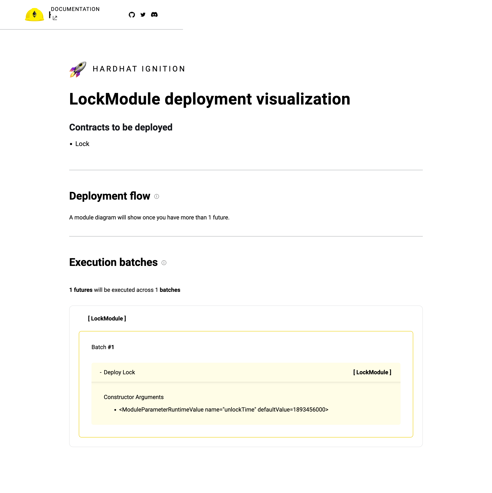

## Write your own contract, test and deploy it

### Write the contract

```solidity
// SPDX-License-Identifier: UNLICENSED
pragma solidity ^0.8.24;

contract Shipping {
   
    enum ShippingStatus {Pending, Shipped, Delivered}
    event LogNewAlert(string description);
    ShippingStatus private status;
    
    constructor() {
        status = ShippingStatus.Pending;
        emit LogNewAlert("Shipping contract was created");
    }
    
    function ship() public {
        require(status == ShippingStatus.Pending, "Can't ship a package that is already shipped or delivered");
        status = ShippingStatus.Shipped;
        emit LogNewAlert("Package was shipped");
    }

    function deliver() public {
        require(status == ShippingStatus.Shipped, "Can't deliver a package that is not shipped");
        status = ShippingStatus.Delivered;
        emit LogNewAlert("Package was delivered");
    }

    function getStatus() public view returns (string memory) {
        if (status == ShippingStatus.Pending) {
            return "Pending";
        } else if (status == ShippingStatus.Shipped) {
            return "Shipped";
        } else {
            return "Delivered";
        }
    }
}
```

### Write the test

```typescript
const { expect } = require('chai');
const hh = require('hardhat');
describe('Shipping', function () {
    
    let shippingContract;

    before(async function () {
        shippingContract = await hh.ethers.deployContract('Shipping', [])
        // let expectedContract = expect(await hh.ethers.deployContract('Shipping', []))
        // shippingContract = expectedContract.__flags.object
    });
    it("should return the status Pedding", async function () {
        expect(await shippingContract.getStatus())
            .to.equal('Pending');
    });
    it("should return the status Shipped", async function () {
        await expect(shippingContract.ship())
            .to.emit(shippingContract, 'LogNewAlert').withArgs('Package was shipped')

        expect(await shippingContract.getStatus())
            .to.equal('Shipped');
    });
    it("should return the status Delivered", async function () {
        await expect(shippingContract.deliver())
            .to.emit(shippingContract, 'LogNewAlert').withArgs('Package was delivered')
        
        expect(await shippingContract.getStatus())
            .to.equal('Delivered');
    });
});
```

==构造方法里抛出事件还不知道怎么写测试代码，待完善 #TO-UPDATE==

### Deploy the contract

- deployment code

```typescript
import { buildModule } from "@nomicfoundation/hardhat-ignition/modules"

module.exports = buildModule("ShippingModule", (m) => {
    const shipping = m.contract("Shipping", [])
    m.call(shipping, "getStatus", [])
    return { shipping }
})
```


- do deployment

```shell
(base) ➜  chain git:(master) ✗ npx hardhat ignition deploy ignition/modules/Shipping.ts --network localhost
Hardhat Ignition 🚀

Resuming existing deployment from ./ignition/deployments/chain-31337

Deploying [ ShippingModule ]

Warning - previously executed futures are not in the module:
 - LockModule#Lock

Batch #1
  Executed ShippingModule#Shipping

Batch #2
  Executed ShippingModule#Shipping.getStatus

[ ShippingModule ] successfully deployed 🚀

Deployed Addresses

LockModule#Lock - 0xCf7Ed3AccA5a467e9e704C703E8D87F634fB0Fc9
ShippingModule#Shipping - 0xDc64a140Aa3E981100a9becA4E685f962f0cF6C9
```


## Write a tool to assist development

[ethers Reference](https://docs.ethers.org/v6/getting-started/)

print the balance aof the deployed contract

```typescript
const { ethers } = require('hardhat');

console.log('ethers', ethers);

async function main() {
    const localModuleAddress = '0x610178dA211FEF7D417bC0e6FeD39F05609AD788';
    const provider = ethers.provider;
    const balance = await provider.getBalance(localModuleAddress);
    const balanceInEther = ethers.formatEther(balance);

    console.log(`address: ${localModuleAddress} balance: ${balance} balanceInEther: ${balanceInEther}`);

    const Shipping = await ethers.getContractFactory('Shipping');
    const shipping = await Shipping.attach(localModuleAddress);
    const status = await shipping.getStatus();

    console.log(`status: ${status}`);
}

main()
    .then(() => process.exit(0))
    .catch(error => {
        console.error(error);
        process.exit(1);
    });
```

the model ethers in hardhat provide ethers utilities and it‘s helper utilities

```typescript
// from hardhat source

declare module "hardhat/types/runtime" {
  interface HardhatRuntimeEnvironment {
    // We omit the ethers field because it is redundant.
    ethers: typeof ethers & HardhatEthersHelpers;
  }

...

export interface HardhatEthersHelpers {
  provider: HardhatEthersProvider;

  getContractFactory: typeof getContractFactory;
  getContractFactoryFromArtifact: typeof getContractFactoryFromArtifact;
  getContractAt: (
    nameOrAbi: string | any[],
    address: string | ethers.Addressable,
    signer?: ethers.Signer
  ) => Promise<ethers.Contract>;
  getContractAtFromArtifact: (
    artifact: Artifact,
    address: string,
    signer?: ethers.Signer
  ) => Promise<ethers.Contract>;
  getSigner: (address: string) => Promise<HardhatEthersSigner>;
  getSigners: () => Promise<HardhatEthersSigner[]>;
  getImpersonatedSigner: (address: string) => Promise<HardhatEthersSigner>;
  deployContract: typeof deployContract;
}

```

run the tool by hardhat

```shell
npx hardhat run tools/checkBalance.js --network localhost
```


# Some Common Rules

The following rules are a summary of some principles I recently learned, for everyone's reference.

- **Efficient Code = Cost Savings**
  Always be mindful of the gas fees associated with the code you write.Any unnecessary code or inefficient implementation will increase gas usage.
  In Solidity, gas fees are a critical consideration when writing smart contracts. Every operation in a smart contract consumes gas, and the total gas consumption determines the cost of executing the contract. Inefficient or unnecessary code can significantly increase gas usage, leading to higher transaction costs. Therefore, it is essential to optimize your code to minimize gas fees. This includes avoiding redundant operations, using efficient data structures, and leveraging Solidity's built-in features to reduce gas consumption. By writing efficient code, you can save on gas fees and make your smart contracts more cost-effective.
- **Security Code = Protect Money**
  Always maintain a strong security awareness. In a decentralized environment, any security vulnerability can lead to the instant loss of your assets.
  In the decentralized environment of blockchain and smart contracts, security is paramount. Unlike traditional systems where central authorities can intervene to mitigate risks, decentralized systems rely heavily on the security measures implemented by developers and users. Any security vulnerability in a smart contract can be exploited by malicious actors, leading to significant financial losses.
  To maintain strong security awareness, developers should:
  - Follow best practices for secure coding.
  - Conduct thorough security audits and testing.
  - Stay updated with the latest security developments and threats.
  - Use well-established libraries and tools that have been vetted by the community.
  Users should also be vigilant by:

  - Only interacting with trusted and audited smart contracts.
  - Keeping their private keys secure.
  - Being cautious of phishing attempts and other social engineering attacks.
  By maintaining a strong security awareness, both developers and users can help protect their assets and ensure the integrity of the decentralized ecosystem.

# Solidity Language
## Storage

There are three types storage，storage，memory，calldata

### storage

Similar to a hard disk in traditional systems, it stores data for long-term preservation (data can be permanently stored on the blockchain) and aligns with the lifecycle of the contract.

In Solidity, the concept of **`storage`** refers to the permanent data storage on the Ethereum blockchain. This storage is analogous to a hard disk in traditional computing systems, as it retains data indefinitely. The data stored in this manner is tied to the lifecycle of the smart contract, meaning it persists as long as the contract exists on the blockchain. This feature is crucial for applications that require **permanent record-keeping**, such as financial transactions, identity verification, and supply chain tracking.

- [ ] expand limit：==#TO-UPDATE==
- [ ] gas fee：==#TO-UPDATE==
- [ ] usage limit：==#TO-UPDATE==
- [ ] related types and structures：==#TO-UPDATE==
- [ ] related evm bytecode：==#TO-UPDATE==

### memory

Similar to memory in traditional systems, it allocates corresponding memory during the execution of contract functions and releases it after execution.

In Solidity, **`memory`** is a temporary storage area used during the execution of a smart contract's functions. It is analogous to RAM (Random Access Memory) in traditional computing systems. Memory is allocated when a function is called and is released once the function execution is complete. This temporary storage is used for variables that are only needed during the function's execution and do not need to persist beyond that. Understanding the distinction between storage and memory is crucial for optimizing gas usage in smart contracts, as **writing to storage is more expensive than using memory**.

- [ ] expand limit：==#TO-UPDATE==
- [ ] gas fee：==#TO-UPDATE==
- [ ] usage limit：==#TO-UPDATE==
- [ ] related types and structures：==#TO-UPDATE==
- [ ] related evm bytecode：==#TO-UPDATE==

### calldata

Calldata is used to store the parameters when a contract is called and is immutable. It is analogous to the function call stack frame in traditional systems and consumes less gas compared to memory.

In Solidity, **`calldata`** is a special data location used to store the input parameters of a contract function call. Unlike **`memory`**, which is writable and used for temporary storage during function execution, **`calldata`** is read-only and cannot be modified. **This makes it suitable for passing large amounts of data to a contract function without incurring the higher gas costs** associated with using **`memory`**.

The use of **`calldata`** is particularly beneficial for functions that need to process large input data, such as those dealing with arrays or strings. By using **`calldata`**, developers can optimize gas usage, making their smart contracts more efficient and cost-effective. Understanding the differences between **`calldata`**, **`memory`**, and **`storage`** is essential for writing efficient and secure Solidity code.

- [ ] expand limit：==#TO-UPDATE==
- [ ] gas fee：==#TO-UPDATE==
- [ ] usage limit：==#TO-UPDATE==
- [ ] related types and structures：==#TO-UPDATE==
- [ ] related evm bytecode：==#TO-UPDATE==


## Data Types

### Value Type

The address of a variable is the direct address where the data is stored. Assigning values between variables involves directly copying the data. Value types are those whose storage size can be determined at compile time.

In Solidity, understanding the concept of value types and their storage is crucial for writing efficient and secure smart contracts. Value types are those whose storage size is known at compile time, such as integers, booleans, and fixed-size arrays. When you assign a value type to another variable, the data is directly copied, meaning that changes to one variable do not affect the other.

Here are some key points about value types in Solidity:

- **Direct Storage**: The address of a variable refers to the direct memory location where the data is stored.
- **Copy Semantics**: When assigning values between variables of value types, the data is directly copied. This means that each variable holds its own independent copy of the data.
- **Compile-Time Determination**: The storage size of value types is determined at compile time, which allows for efficient memory management and optimization.

Examples of value types in Solidity include:

- Integers (e.g., `uint256`, `int256`)
- Booleans (`bool`)
- Fixed-size arrays (e.g., `uint256[3]`)
- Enums

Understanding these concepts helps in writing more predictable and efficient code, as well as in managing gas costs effectively.

#### Boolean

boolean type has two value `true` and `false`

```solidity
bool b; // default false
bool a; // default false
!b // true
a == b // false
a != b // false
a && b // false
a || b // true
```

##### Short-circuit evaluation
In Solidity, boolean type operators such as `&&` (logical AND) and `||` (logical OR) follow the short-circuit evaluation rules, just like in C, C++, Java, and other languages derived from C. Short-circuit evaluation means that the second operand is only evaluated if the first operand does not determine the outcome of the expression.
- **Logical AND (`&&`)**: If the first operand is `false`, the second operand is not evaluated because the overall expression will be `false` regardless of the second operand's value.
- **Logical OR (`||`)**: If the first operand is `true`, the second operand is not evaluated because the overall expression will be `true` regardless of the second operand's value.

#### Integer

==#TO-UPDATE==

#### Address

==#TO-UPDATE==

#### Enum

==#TO-UPDATE==

#### User Defined Value Types

why use user defined values?

- Improve type safety, compiler will check the type compatible
- Improve code readability

limitation：

- can not use its native type operator
- no implicit type conversion between custom value types and native types. 

examples：

```solidity
type C is V

type Age is uint8
type Temperature is int16
```

### Reference Type

#### Array

##### Static Byte Array

==TO-UPDATE==

##### Dynamic Array

==TO-UPDATE==

##### Array Slice

==TO-UPDATE==

#### Strut

==TO-UPDATE==

#### Mapping

==TO-UPDATE==

## Control Flow

### Condition: if-else，no switch-case

just like the code in C，when `test-statement` is `true`，the conditional code block will be executed

```solidity
if (test-statement) {
  // do a logic
} else if (test-statement) {
  // do b logic
} else {
  // do else logic
}
```

### Loop：for / while /do while

just like the code in C, when `test-statement` is `true`, the loop continues to execute; otherwise, it exits the loop. Unlike `while`, `do...while` ensures that the loop body is executed at least once.

```solidity
for (init-statement; test-statement; iteration-statement) {
  if (a) {
    continue;
  }
  if (b) {
    break;
  }
  // do loop logic
}

while (test-statement) {
  if (a) {
    continue;
  }
  if (b) {
    break;
  }
  // do loop logic
}

do {
  if (a) {
    continue;
  }
  if (b) {
    break;
  }
  // do loop logic
} while(test-statement)
```

### Assertion：require / assert / revert

Generally, require check the function input and output data, assert check the contract state, revert used with if-else statement.

```solidity
require(test-statement, "test failed message");

assert(test-statement);

if (has_wrong_data) {
  revert("error message");
}

if (has_wrong_data) {
  revert CustomError(arg1, arg2);
}
```

## Function
### Function Definition
A Solidity function is combined by

- `function` keyword and function name
- parameter list
- visibility keyword (`internal`, `external`, `private`, `public`)
- state mutablitity keyword (`pure`,`view`,`payable`)
- modifiers
- `returns` keyword and return list

[Reference: RemoteCodeCamp Solidity Quick Start](https://solidity-rcc.vercel.app/docs/solidity-basic/function)

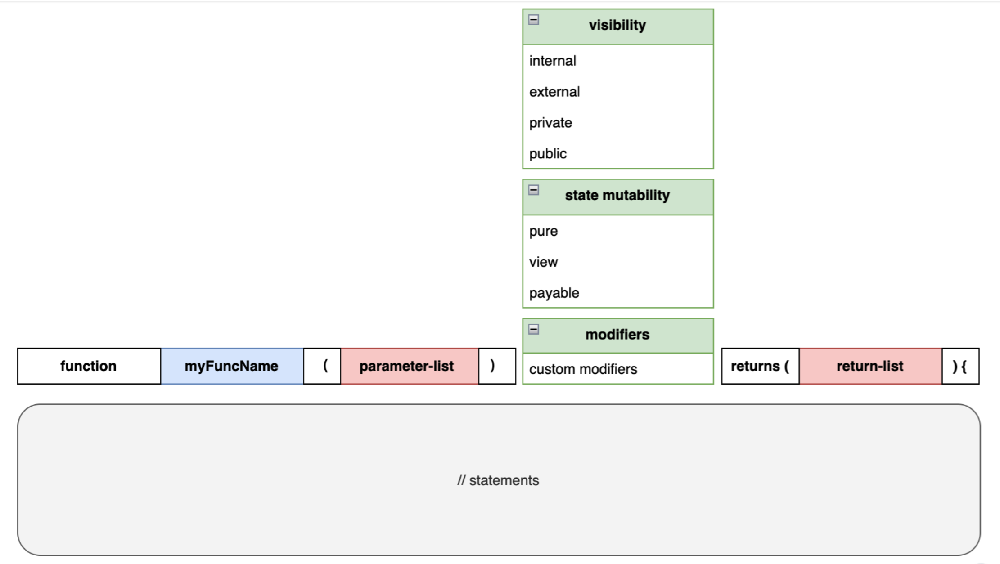

#### function name

==#TO-UPDATE==

#### parameter list / return list

```solidity
function name(T1 a1, T2 a2, T3 a3) public returns (T1, T2, T3)
```

#### visibility

Variables can use three visibility modifiers:

- `public` indicates that the variable can be accessed within the current contract and externally.
- `private` indicates that the variable can only be accessed within the current contract.
- `internal` indicates that the variable can only be accessed within the current contract or its derived contracts.

Functions can use all four of the above modifiers:

- `public` indicates that the function can be accessed within the current contract and externally.
- `external` indicates that the function can only be accessed externally from the current contract.
- `private` indicates that the function can only be accessed within the current contract.
- `internal` indicates that the function can only be accessed within the current contract or its derived contracts.

[Reference: RemoteCodeCamp Solidity Quick Start](https://solidity-rcc.vercel.app/docs/solidity-basic/visibility)

**Public** visibility between three types of contracts

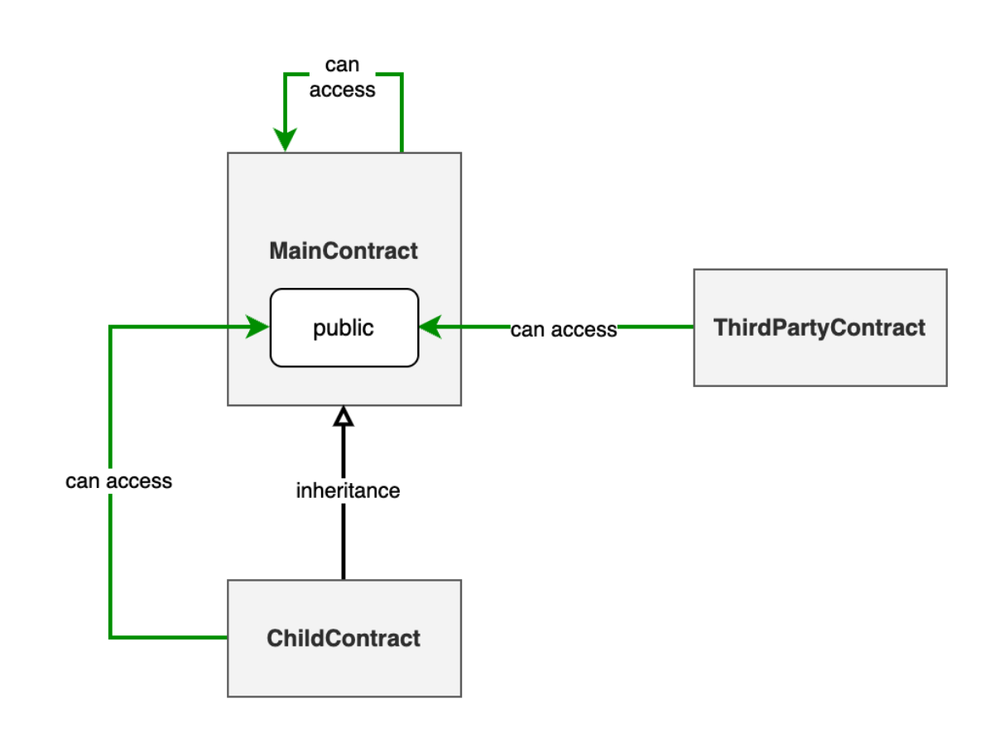

**External** visibility between three types of contracts

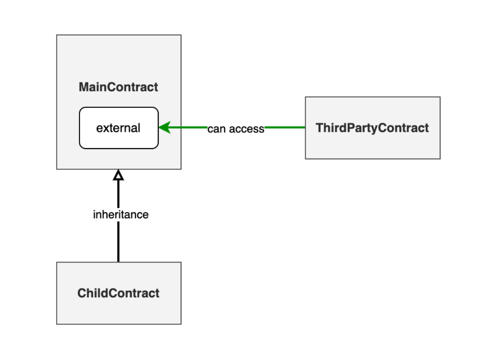

**Internal** visibility between three types of contracts 

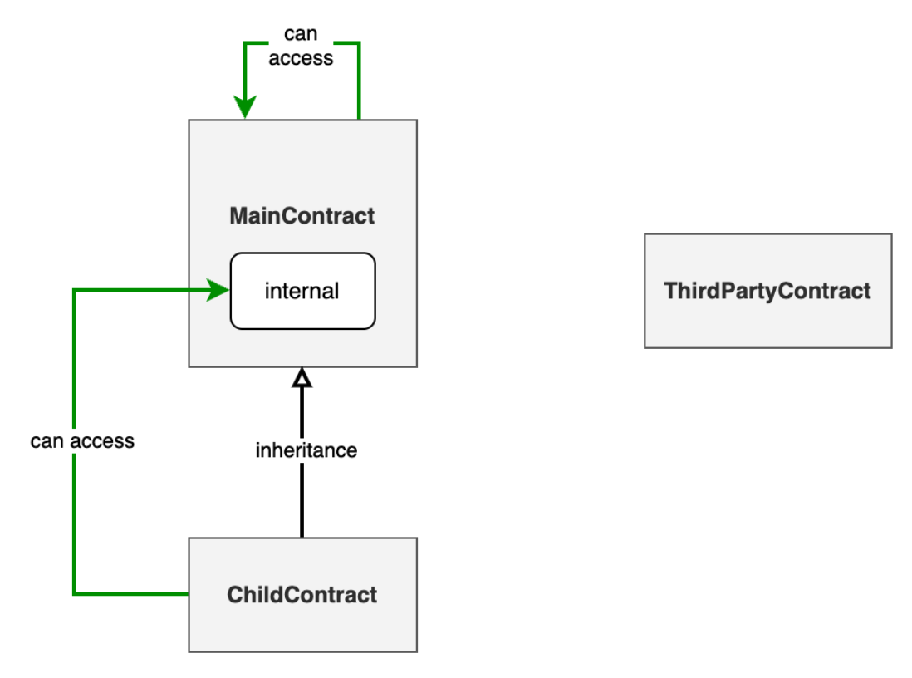

**Private** visibility between three types of contracts 

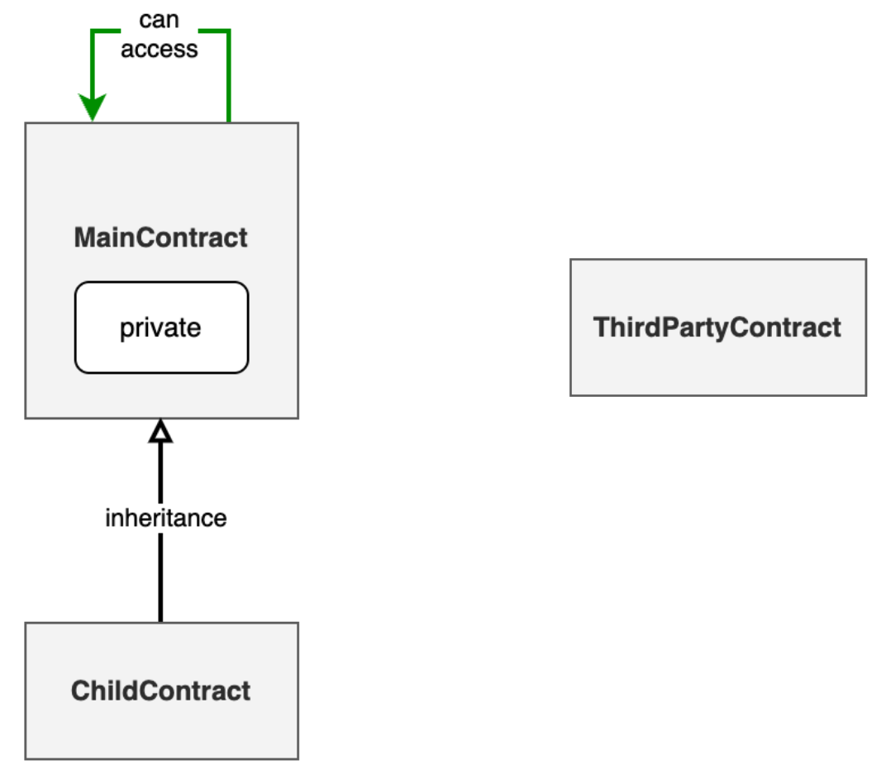

#### state mutability

State mutability tells the compiler what things the function can not do.

- View functions can only query the contract state and cannot modify it. In simple terms, they are read-only.

- Pure functions cannot query or modify the contract state. They can only perform simple calculations using function parameters and return the result.

- Payable functions allow the function to accept Ether transfers. By default, functions cannot accept transfers. If you need to accept transfers, you must specify the function as payable.

|                                    | normal  | view   | pure   | payable |
| ---------------------------------- | :-----: | ------ | ------ | ------- |
| read contract state                |   yes   | yes    | no     | yes     |
| modify contract state              |   yes   | no     | no     | yes     |
| consume gas when called externally | ==yes== | ==no== | ==no== | yes     |
| accept ether transfers             |   no    | no     | no     | yes     |

##### The actions with contract state read

- Reading state variables
- Accessing `address(this).balance` or `<address>.balance`
- Accessing members of `block`, `tx`, and `msg`
- Calling any function not marked as `pure`
- Using inline assembly that contains certain opcodes

##### The actions with contract state modify

- Modifying state variables

- Triggering events
- Creating other contracts
- Using `selfdestruct` to destroy contracts
- Sending Ether through function calls
- Calling any function not marked as `view` or `pure`
- Using low-level calls such as `transfer`, `send`, `call`, `delegatecall`, etc.
- Using inline assembly that contains certain opcodes

##### **Return data difference between pure/view and non-pure/view** 

In Hardhat, when interacting with Solidity contracts, it's important to understand the difference between calling `pure`/`view` functions and non-`pure`/`view` functions.

- **`pure` and `view` functions**: These functions are read-only and do not modify the blockchain state. They can be called directly and return the result immediately. The return type matches the type defined in the Solidity function.

- **Non-`pure` and `view` functions**: These functions modify the blockchain state and require a transaction to be sent to the network. The transaction is processed asynchronously by miners, which means it may take some time to be included in a block. When calling these functions, Hardhat returns a `ContractTransactionResponse` object, which contains information about the transaction, such as the transaction hash.

=="According to ChatGPT's suggestions==, there are three methods to obtain the return data of non-pure/view functions from external calls.

1. Write the data that needs to be returned into a state variable, and then provide a separate view function to read the data after the transaction is executed.

   ```solidity
   contract MyContract {
       uint public result;
   
       function setAndGetResult(uint value) public {
           result = value;
       }
   
       function getResult() public view returns (uint) {
           return result;
       }
   }
   ```

2. Encapsulate the data that needs to be returned into an event, and read the event from the transaction log to extract the return value 

   ==not yet successfully attempted  #TO-UPDATE==

3. Pass the result between contracts using a callback method

   ==relatively complex, not yet attempted #TO-UPDATE==

#### modifier
```solidity
modifier modifierName {
  // pre code
  _;
  // post code
}
```

Modifiers in Solidity are similar to aspects in Java or decorators in Python. They decouple common logic that needs to be executed before and after the main logic of functions, making it easier to reuse and keeping the function's business logic clearer and easier to maintain.

Usage Scenarios：

- Access Control

  used with `require` to check the message sender if it has the rights to call the function

- Validation

  used with `require` to check the input variables

- Logging

  add logging or auditing functionality before and after executing the main logic.

Modifer can have parameter like function，the parameter value is binded when the function is called so if you want modifer to log the contract state，be care not use the modifer parameter to bind the contract stage，just use the state in the modifer code

```solidity
contract FunctionTest {
    uint private retValue;
    
    modifier logReturn1(uint retValue) {
        _;
        console.log("Function executed with return value: %d", retValue);
    }
    
    modifier logReturn2() {
        _;
        console.log("Function executed with return value: %d", retValue);
    }
    
    function doLogableAction() public logAccess logReturn1(retValue) logReturn2 {
        retValue = 100;
    }
}
```

```shell
eth_getTransactionByHash
eth_blockNumber
eth_feeHistory
eth_sendTransaction
  Contract call:       FunctionTest#doLogableAction
  Transaction:         0xe3621a33d71ad95a013c6ea346dfad0fd6d90af8583ff52e14d9b488010f5bad
  From:                0xf39fd6e51aad88f6f4ce6ab8827279cfffb92266
  To:                  0x276c216d241856199a83bf27b2286659e5b877d3
  Value:               0 ETH
  Gas used:            49156 of 30000000
  Block #119:          0xb9155adc0f2f081acf5d617cb2a825b57150d3b5b8762e7562d83a6f85631fb0

  console.log:
    Access granted
    Function executed with return value: 100
    Function executed with return value: 0
```


## Contract

A Solidity contract is combined by

- Procedure
  - constructor definition
  - function definition
  - modifier definition
  - fallback function definition
  - receive function definition
- Data
  - state variable definition
  - struct definition
  - enum definition
  - event definition
  - error definition
  - custom type definition

### constant / immutable
|  | `constant`  | `immutable`  |
| - | - | - |
|Initialization Time| variables are initialized at compile time.|variables are initialized at contract deployment time.|
|Storage Location|variables do not occupy storage space because they are replaced with actual values at compile time.|variables are stored in the contract's code segment after deployment, do not occupy storage space, but can be accessed at runtime.|
|Usage Scenarios|is suitable for values that are known at compile time and will not change.|is suitable for values that are set at deployment time and will not change, such as configuration parameters."|
### constructor

==TO-UPDATE==

### receive function

receive function format is fixed, must be external, no function keyword, payable

```solidity
receive() external payable {
    // receive logic
}
```

==TO-UPDATE==

### fallback function

==TO-UPDATE==

# Appendix

## Some error will occured in your code

- The position of variable accessibility modifiers

**`wrong code`**
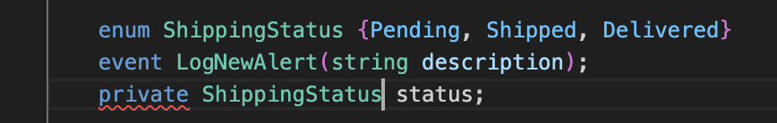
**`correct code`**

```solidity
ShippingStatus private status;
```


- Function return value modifiers

**`wrong code`**

```solidity
    function getStatus() public pure returns (string memory) {
        if (status == ShippingStatus.Pending) {
            return "Pending";
        } else if (status == ShippingStatus.Shipped) {
            return "Shipped";
        } else {
            return "Delivered";
        }
    }
```
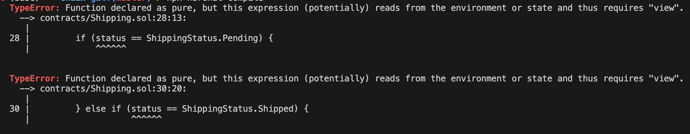

**`correct code`**

```solidity
    function getStatus() public view returns (string memory) {
        if (status == ShippingStatus.Pending) {
            return "Pending";
        } else if (status == ShippingStatus.Shipped) {
            return "Shipped";
        } else {
            return "Delivered";
        }
    }
```

- memory数组默认声明类型和字面量推导不兼容1

**`error code`**

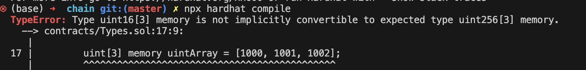

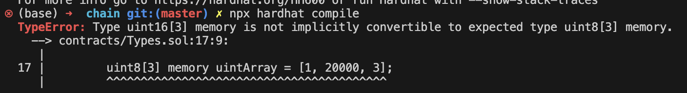


**`correct code`**

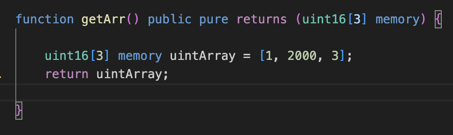
